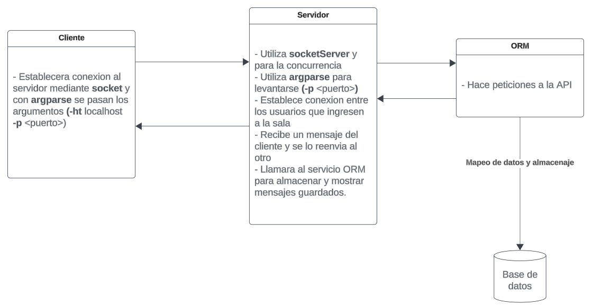

# LivePychat
LivePychat es un chat en salas en tiempo real creado para el final de la materia Computacion-II de la Universidad de Mendoza

## Arquitectura
La arquitectura del chat se basa en:

## 🔧 Herramientas utilizadas 🔧
Se utilizaron las siguientes herramientas:
* [Socket](https://docs.python.org/es/3/library/socket.html) - Para la comunicacion entre cliente y servidor
* [Threading](https://docs.python.org/es/3.8/library/threading.html) - Para el envio y recepcion de mensajes del cliente
* [Socketserver](https://docs.python.org/es/3/library/socketserver.html) - Utilizado en el servidor
* [Colorama](https://pypi.org/project/colorama/) - Para la IU que ve el cliente